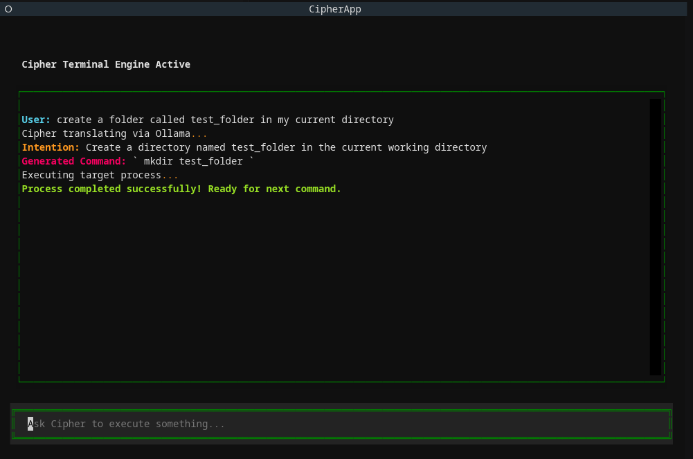
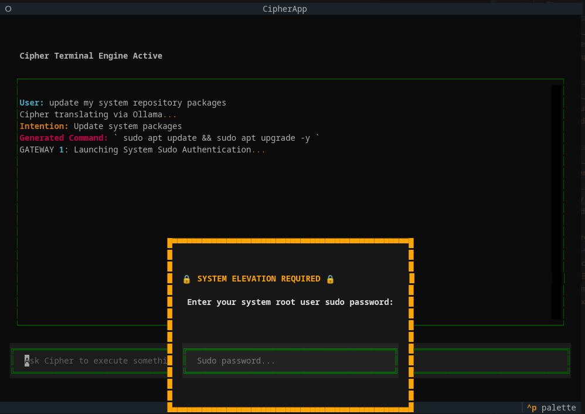

# Project Cipher - AI-powered Linux Command Interface

<p align="center">
  
</p>

## Description

Project Cipher is an intelligent, secure terminal assistant that lets you interact with your Linux command line using plain English. It bridges the gap between natural language and shell execution, translating your intent into accurate bash commands on the fly. 

* **What was my motivation?** I wanted to explore how to safely connect generative AI with direct OS-level execution. LLMs are notoriously unpredictable, so the real challenge was building an interface where a local model could look up and run shell scripts without accidentally destroying the host machine.
* **What problem does it solve?** It eliminates the need to memorize complex terminal syntax for daily tasks while keeping the system entirely safe. If you ask it to do something minor, it runs it instantly. If you ask it to do something dangerous or administrative, it locks down the interface and demands validation.
* **What did I learn?** I mastered map-reducing natural language user intent into structured, deterministic shell code using Python and local LLMs. I learned how to handle advanced runtime safety by using Python to tokenize and intercept hazardous bash commands before they ever hit the operating system layer. Additionally, I learned how to securely manage OS-level subprocess streams—piping standard input variables dynamically without deadlocking the host environment—while wrapping the entire pipeline in an asynchronous `Textual` TUI framework to keep the engine responsive.

---

## Table of Contents

- [Features](#features)
- [Tech Stack](#tech-stack)
- [Project Structure](#project-structure)
- [Installation](#installation)
- [Usage](#usage)
- [Security Considerations](#security-considerations)
- [Version & Future Roadmap](#version--future-roadmap)
- [Contributing](#contributing)
- [License](#license)
- [Contact](#contact)

---

## Features

* **Natural Language Translation:** Converts abstract English descriptions into optimized bash syntax locally.
* **Dual-Gated Security Modals:** Automatically detects dangerous commands (`rm -rf`) or root requirements (`apt`, `systemctl`) and pops up distinct, sequential verification layers.
* **Asynchronous execution:** Heavy terminal actions (like system updates) run in isolated background threads so the user interface never hangs or freezes.
* **Cryptographic First Boot:** Scans the system on launch and automatically walks you through a setup screen to encrypt your backup security answer if it's missing.

---

## Tech Stack

* **Programming Language:** Python 3.12
* **TUI Framework:** Textual (Terminal User Interfaces)
* **Local AI Core:** Ollama 
* **Validation:** Pydantic v2
* **Concurrency:** Asyncio subprocess routing

---

## Project Structure

```text
Project-Cipher/
├── assets/
│   └── images/
│       ├── hacker-meme.gif       # UI demo animation
│       ├── mkdir_test.png        # Screenshot for Test Case 1
│       └── sudo_ps_request.png   # Screenshot for Test Case 2
├── cipher/
│   ├── __init__.py
│   ├── app.py                  # Main TUI Application Orchestrator
│   ├── agent/
│   │   ├── __init__.py
│   │   ├── orchestrator.py     # Handles LLM translation & mapping via Ollama
│   │   └── prompts.py          # Holds system instructions & few-shot examples
│   ├── tools/
│   │   ├── __init__.py
│   │   ├── executor.py         # Runs async shell sub-processes via asyncio
│   │   └── guardrail.py        # Verifies sudo, scans rules, and hashes keys
│   └── ui/
│       ├── __init__.py
│       └── screens.py          # Main workspace & sequential verification modals
├── .env                        # Local configurations & stored hashes (git ignored)
├── requirements.txt            # Application dependencies
└── README.md
```

---

## Installation

### Prerequisites
Ensure your local machine has [Ollama](https://ollama.com/) installed and running. Download your target inference model:
```bash
ollama run gemma3:8b # Choose your own LLM
```

1.  **Clone the repository:**
    ```bash
    git clone https://github.com/AshritWajjala/Project-Cipher.git
    cd Project-Cipher
    ```
2.  **Configure Environment & Dependencies:**
    ```bash
    python3 -m venv venv
    source .venv/bin/activate  

    # Install core dependencies
    pip install -r requirements.txt
    ```
4.  **Launch the Core Application:**
    ```bash
    python3 -m cipher.app
    ```

## Usage

Once the user interface initializes via `python3 -m cipher.app`, you can issue natural language requests directly into the bottom prompt bar. The underlying orchestration engine routes your intent through distinct safety states depending on the generated command's privilege tier:

### Test Case 1: Standard Non-Privileged Execution Flow
When processing low-risk or non-root utility requests, the pipeline bypasses modal authentication layers completely. It translates the raw intent to explicit syntax, runs the subprocess asynchronously, and displays an isolated lifecycle status message.


*Figure 1: Translating a routine directory statement into an automated, non-blocking execution block.*

* **User Input:** `create a folder called test_folder in my current directory`
* **Engine Intention Recognition:** `Create a directory named test_folder in the current working directory`
* **Dynamic Command Generation:** `mkdir test_folder`
* **Result Matrix:** Evaluated as safe ➔ Executed instantly ➔ System outputs positive return token: `✨ Process completed successfully! Ready for next command.`

---

### Test Case 2: Multi-Factor Administrative Isolation
If a natural language query maps to a core system file binary or restricted action (`apt`, `systemctl`), the core application halts further execution immediately. The background dims, layout parameters tighten to 38 cells to keep background logs entirely visible, and focus shifts to the validation gateway stack.


*Figure 2: System elevation caught; a compact, non-obstructive orange overlay isolates root password piping.*

* **User Input:** `update my system repository packages`
* **Engine Intention Recognition:** `Update system packages`
* **Dynamic Command Generation:** `sudo apt update && sudo apt upgrade -y`
* **Security Interception Trace:** The guardrail intercepts the string, freezes the main processing thread, records state transitions clearly onto the open background display (`GATEWAY 1: Launching System Sudo Authentication...`), and mounts the compact verification modal.

## Security Considerations

**WARNING:** Running applications that execute generated shell scripts carries inherent system risks. Project Cipher is designed around a Zero-Trust AI mindset to isolate potential risks.

---

## Versioning & Future Roadmap

**Current Version:** `v1.0.0 (MVP)`

While Project Cipher is fully operational as a localized proof-of-concept, the following architectural upgrades are slated for future releases:

* **Dynamic Command Diff Viewer:** Introduce a split-pane modal UI showing a real-time side-by-side comparison of the natural language intent versus the generated shell script before a user confirms execution.
* **Contextual Session Memory:** Upgrade the agent framework to support short-term chat histories, allowing users to issue relative follow-up adjustments (e.g., Submitting `make a folder named test`, followed by `move into it`).
* **Granular Rule Engine Configurator:** Build a localized setting panel to let administrators toggle specific string token guardrails dynamically without updating the python source modules.
* **Encrypted Credential Cache:** Replace environment-based token verification with a temporary, securely cleared operational memory cache to manage cached privilege tickets safely.

---

## Contributing

Contributions are welcome! Please fork the repository and submit a pull request with your changes.

---

## License

Distributed under the MIT License. See the [LICENSE](https://opensource.org/licenses/MIT) page for more information.

---

## Contact

**Ashrit Wajjala** - [ashritw2000@gmail.com](mailto:ashritw2000@gmail.com)

* **GitHub:** [github.com/AshritWajjala](https://github.com/AshritWajjala)
* **LinkedIn:** [linkedin.com/in/ashritwajjala](https://linkedin.com/in/ashritwajjala) 

*Project Link:* [https://github.com/AshritWajjala/Project-Cipher](https://github.com/AshritWajjala/Project-Cipher)
